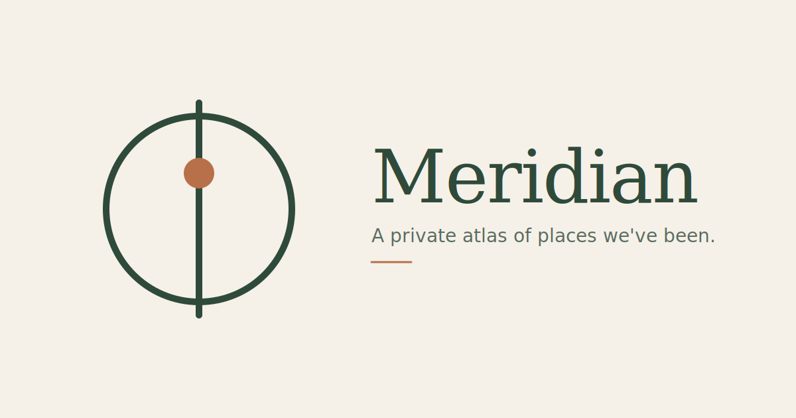

# Meridian

<p align="center">
  
</p>

> 一个旅行记录网站。公开的世界地图展示去过的地方；鉴权后可新建、编辑、删除；部分记录可上锁，需要独立的查看密码才能看到内容。


## 1. 技术栈

| 层 | 选型 | 说明 |
|---|---|---|
| 框架 | Next.js 15 (App Router) + React 19 | Server Components |
| 部署 | Vercel | Hobby 免费版 |
| 数据库 | Neon Postgres | `@neondatabase/serverless` driver（HTTP-based） |
| 图片存储 | Cloudflare R2 | S3 兼容，用 `@aws-sdk/client-s3` |
| 地图 | Mapbox GL JS | 底图 + 标记 + 聚合 |
| 鉴权 | iron-session | 加密 cookie + 硬编码密码 |
| 样式 | Tailwind CSS | |
| 动画 | framer-motion（或 motion） | 面板滑入、按钮反馈 |
| Markdown 编辑器 | [MDXEditor](https://mdxeditor.dev/) | WYSIWYG |
| 客户端图片压缩 | `browser-image-compression` | 压原图 + 生成缩略图 |
| i18n | next-intl | UI 文案 + 地图地名 |
| 语言 | TypeScript strict | |

本地开发：不需要模拟数据库或图床。开发者会自己准备好 Neon 和 R2 的 dev 环境凭据，填入 .env.local。代码不需要 mock 或本地 fallback。


---

## 2. 数据模型

Postgres 单表 `places`：

```sql
CREATE TABLE places (
  id SERIAL PRIMARY KEY,
  lat DOUBLE PRECISION NOT NULL,
  lng DOUBLE PRECISION NOT NULL,
  title TEXT NOT NULL,
  content TEXT NOT NULL DEFAULT '',
  images TEXT[] NOT NULL DEFAULT '{}',          -- 原图 URL 数组
  thumbnails TEXT[] NOT NULL DEFAULT '{}',      -- 缩略图 URL 数组，和 images 一一对应
  author TEXT,                                   -- 署名，可空
  visited_at DATE,
  is_locked BOOLEAN NOT NULL DEFAULT FALSE,
  share_token TEXT,                              -- 加锁记录的分享 token，随机串
  created_at TIMESTAMPTZ NOT NULL DEFAULT NOW()
);

CREATE INDEX idx_places_visited_at ON places(visited_at);
CREATE INDEX idx_places_share_token ON places(share_token) WHERE share_token IS NOT NULL;
```

**字段说明：**
- `images` 和 `thumbnails` 数组长度必须保持一致，索引对应
- `share_token`：仅加锁记录有值，随机 32 字符串（`crypto.randomBytes(16).toString('hex')`）
- `author`：自由输入的署名，可空

---

## 3. 页面结构

```
/                            公开主页，只读地图
/?place=123                  打开后定位到指定记录并展开详情
/?place=123&key=xxx          带 token，自动解锁该条加锁记录
/login                       登录页
/edit                        编辑页（需编辑密码）
```

---

## 4. API 设计

```
GET    /api/places                返回所有地点。加锁记录只返回脱敏字段
GET    /api/places/[id]           获取单条，加锁需要 token 或 unlocked cookie
POST   /api/places                鉴权，新增
PATCH  /api/places/[id]           鉴权，更新
DELETE /api/places/[id]           鉴权，删除
POST   /api/places/[id]/reset-token  鉴权，重置加锁记录的 share_token

POST   /api/auth                  登录（编辑密码）
DELETE /api/auth                  登出
POST   /api/unlock                提交查看密码，成功写 unlocked cookie（7 天）

POST   /api/upload                鉴权，生成 R2 预签名上传 URL

GET    /api/export                鉴权，返回所有数据的 JSON（备份用）
```

### 加锁记录的脱敏逻辑

`GET /api/places` 对加锁记录只保留：`id`, `lat`, `lng`, `is_locked: true`, `created_at`

移除：`title`, `content`, `images`, `thumbnails`, `author`, `visited_at`, `share_token`

前端拿到后渲染为纯 🔒 标记。如果请求带有效 `unlocked` cookie 或 URL 有匹配 token，对应记录返回完整数据。

---

## 5. 视觉与交互总则

项目名 **Meridian**，设计基调参考 claude.ai：

- **极简**：大量留白、中性色、极少装饰
- **圆角**：所有容器和按钮统一圆角（`rounded-xl` / `rounded-2xl`）
- **弹性感**：交互反馈用 spring 曲线，全局统一一套配置
- **不过度动效**：追求"用起来舒服"而非炫技
- **不要破坏原生滚动回弹**：**不要**写 `overscroll-behavior: none`

### 布局

**桌面端：**
- 左上角：标题 "Meridian" + 副标题
- 右上角：登录/登出按钮 + 中英切换按钮
- 主体：全屏 Mapbox 地图
- 底部：时间轴（约 80-100px 高）
- 详情面板：**右侧滑入**，宽度约 420px

**移动端：**
- 标题可缩小
- 右上角按钮不变
- 底部时间轴保留
- 详情面板：**底部滑入**，默认约 40% 屏高，顶部"把手"可上拖展开到全屏
- 使用 `100dvh`（iOS Safari 适配）
- 考虑 `safe-area-inset-bottom`

---

## 6. 地图行为

### 底图

- Mapbox `light-v11` 或类似浅色样式
- 地名语言跟随 UI 语言切换：`setLayoutProperty('text-field', ...)` 动态切换，中文 `['get', 'name_zh-Hans']`，英文 `['get', 'name_en']`，fallback `['get', 'name']`

### 标记

**两种类型：**

1. **正常标记**（未加锁 / 已解锁）：
   - 圆形背景 + **第一张图的缩略图**作为背景
   - 下方或侧边显示标题（随 zoom 决定是否显示，Mapbox 自带碰撞检测）
   - 没有图片的记录：纯色圆圈 + 小图标占位

2. **加锁标记**（未解锁）：
   - 纯色圆圈（灰色/中性色）+ 🔒 图标
   - **不显示**任何缩略图、标题、日期
   - 即使在高 zoom 级别也不显示标题

**冒出动效**：scale 0 → 1，spring 曲线，轻微 overshoot

### 聚合

- Mapbox `cluster` 功能（GeoJSON source `cluster: true`）
- 邻近点聚合为圆圈显示数字
- 点击聚合点：地图 `easeTo` 放大到该区域

### 交互

- 拖动缩放用 Mapbox 默认
- 点击正常标记：详情面板从边缘滑入
- 点击加锁标记：滑入简化版"解锁面板"，显示"此记录已加锁"+ 密码输入框
- 点击聚合点：平滑放大

---

## 7. 时间轴（底部）

### 核心概念

时间轴是**一年宽的视觉窗口**，在整个历史时间线上滑动。**筛选逻辑是"指针之前的所有时间"**（累计），不是窗口范围。

### 视觉

- 底部约 80-100px，半透明背景
- 横轴从左到右 = 一年
- 刻度：年份 + 月份标签
- "现在"指针**永远在最右端**（竖线 + "现在" / "Now" 标签）
- 轴上用小圆点标示"这个时间有记录"（加锁记录也标示，不泄露内容）

### 交互

- **拖拽时间轴**：整条轴左右平移，指针不动
- **桌面端滚轮**：hover 时间轴时滚轮前后滚 = 平移
- **回到现在按钮**：指针不在"现在"时显示，点击平滑归位

### 筛选逻辑

- 指针指向 `t`，显示所有 `visited_at <= t`
- 没有 `visited_at` 的记录当作"现在"永远显示
- 前端 filter，不请求后端

### 拖动停止后的飞行

- 停止 **300ms** 后，地图 `flyTo` 到"最近冒出的标记"的地理中心
- 若这段拖动没有新标记出现，不飞
- 多个同时出现时取 `visited_at` 最接近指针的那个

---

## 8. 上锁功能

### 加锁记录未解锁时暴露的信息

✅ 暴露：位置（经纬度）、"这里有加锁记录"的事实、🔒 图标

❌ 隐藏：标题、内容、图片（原图和缩略图）、日期、署名、`share_token`

API 层脱敏，前端拿不到就是拿不到。

### 全局解锁流程

1. 点加锁标记弹出解锁面板
2. 输入查看密码，POST `/api/unlock`
3. 后端比对 `process.env.VIEW_PASSWORD`
4. 成功：写 `view-session` 加密 cookie（iron-session，`maxAge: 7 天`）
5. 前端重新拉 `/api/places`，这次加锁记录返回完整数据
6. 🔒 标记自动变正常（冒出动画）

**Cookie 独立于编辑 session**。编辑密码和查看密码用两个独立 session cookie。

### 分享链接（带 token）

**URL**：`/?place=123&key=xxx`

1. 前端 mount 读取 `place` 和 `key`
2. 请求 `GET /api/places/123?key=xxx`
3. 后端查表，`id=123` 且 `share_token=xxx` 就返回完整数据（即使加锁）
4. 前端地图居中 + 展开详情
5. **不**写 cookie（此解锁只对这一条，不影响其他）

**URL（无 token）**：`/?place=123`

1. 地图居中到该位置
2. 加锁且未解锁：标记仍是 🔒，不展开面板，toast 提示"此记录已加锁，需要密码才能访问 / This record is locked"
3. 未加锁或已解锁：正常展开详情

### 重置 share_token

编辑加锁记录时有"重置分享链接 / Reset share link"按钮：
- 点击后二次确认
- `POST /api/places/[id]/reset-token`
- 后端生成新 token 存库返回
- 前端更新显示的"可复制分享链接"区域

编辑面板显示：
- 当前分享链接（一键复制）
- 提示："任何人打开此链接可直接查看这条记录 / Anyone with this link can view this record"

### 上锁开关

编辑面板有"上锁 / Lock"开关：
- 打开：`is_locked = true`，后端生成 `share_token`
- 关闭：`is_locked = false`，清空 `share_token`
- 上锁仅限制"主页访问"，不影响编辑（编辑权限独立）

---

## 9. 图片处理

### 上传流程

用户选择 / 粘贴 / 拖拽到编辑器：

1. **客户端双份压缩**（`browser-image-compression`）：
   - **原图**：最长边 1600px，质量 0.85，JPEG，通常 500KB-1MB
   - **缩略图**：最长边 400px，质量 0.7，JPEG，通常 30-80KB
2. 分别请求 `/api/upload` 拿预签名 URL
   - 文件名：`original/${timestamp}-${rand}.jpg` 和 `thumb/${timestamp}-${rand}.jpg`
3. 浏览器 PUT 直传 R2
4. 保存时原图 URL 进 `images`，缩略图 URL 进对应 index 的 `thumbnails`
5. 失败 toast："上传失败 / Upload failed"

### 展示

- **地图标记背景**：`thumbnails[0]`
- **详情面板图片 grid**：缩略图 + ``
- **放大查看**：点击缩略图后加载 `images[i]` 全屏展示
- **Markdown 内的 ``**：默认加载原图（已是 1600px 压过）+ `loading="lazy"`

### 粘贴和拖拽

MDXEditor 内支持：
- Ctrl/Cmd + V 粘贴图片
- 拖拽图片到编辑器
- 弱化显示"上传按钮"作为 fallback

每次都走上面的双份压缩流程。

---

## 10. 详情面板

### 查看模式

**桌面端（右侧 420px）：**
- 顶部：标题、访问日期、**署名**（灰色小字 "— by 小明"）、关闭按钮
- 图片区：缩略图 grid（2 列），点击展开全屏原图
- 正文：Markdown 渲染
- 底部（仅编辑权限可见）：编辑、删除按钮
- 右上角：**分享按钮**（所有记录都有），点击复制 `/?place=123`（加锁记录复制带 token 的）

**移动端（底部滑入）：**
- 默认 40% 屏高，顶部"把手"
- 上拖展开全屏，下拖收起
- spring 动画

### 编辑模式

点"编辑"切换。UI 复用新建。**位置不允许改**。

### 加锁记录的面板

点未解锁的 🔒 标记：
- 弹出**简化版面板**，只显示锁图标 + "此记录已加锁"文案 + 密码输入 + 解锁按钮
- 解锁成功后同面板切换为正常查看模式（平滑过渡）

---

## 11. 新建流程

仅鉴权后显示"新建 / New"按钮。

### 选点阶段（拖拽大头针）

1. 点"新建"后：
   - 地图中心出现**固定在屏幕中心的大头针**
   - 拖地图（大头针相对地图移动，屏幕位置不变）
   - 顶/底部 confirm bar：当前坐标 + "取消" / "确认"
2. 确认后大头针落下，打开编辑面板

### 编辑面板字段

- **标题**（必填）
- **访问日期**（date picker，默认今天）
- **署名**（text input，**下拉显示之前用过的 author**，可选或新增）
  - 实现：从所有 places 的 `author` 去重做下拉选项
- **上锁开关**（默认关）
- **正文**（MDXEditor）
- **图片**：粘贴 / 拖拽 / 按钮
- **保存 / 取消** 按钮

保存后关闭面板，新标记冒出。

---

## 12. 编辑已有记录

- 查看面板点"编辑"切换
- 同面板复用新建 UI
- 位置不允许改
- 加锁记录额外显示：
  - 当前分享链接（可复制）
  - "重置分享链接"按钮

删除：圆角确认 dialog，确认后标记 scale → 0 消失。

---

## 13. 鉴权（两套独立密码）

### 编辑密码（`AUTH_PASSWORD`）

- 登录 `/login`，POST `/api/auth`
- 成功写 `session` cookie（iron-session，`{ loggedIn: boolean }`）
- 配置：`httpOnly`, `secure`, `sameSite: 'lax'`, 30 天
- `/edit` Server Component `await getSession()` 未登录 redirect
- 所有写类 API 开头校验，未登录 401

### 查看密码（`VIEW_PASSWORD`）

- 独立 session cookie：`view-session`（`{ unlocked: boolean }`）
- `maxAge: 7 天`
- POST `/api/unlock` 提交密码
- `GET /api/places` 和 `GET /api/places/[id]` 读 cookie 决定是否返回加锁数据

### 两个 cookie 的关系

互相独立。**但代码里做一层便利**：有 `session.loggedIn` 时直接返回完整数据（编辑者不用再解锁）。

---

## 14. 国际化（i18n）

**范围：**
- ✅ UI 文案
- ✅ 地图地名
- ❌ 用户记录内容

**实现：**
- `next-intl`
- 语言存 localStorage，默认跟随 `navigator.language`
- 右上角 "中 / EN" 按钮，立即切换不刷新
- Mapbox layer 监听语言变化 `setLayoutProperty('text-field', ...)`

---

## 15. 备份功能

`GET /api/export`（需编辑鉴权）：

- 返回 JSON 格式所有 places（包括加锁记录的完整内容）
- `Content-Disposition: attachment; filename="meridian-backup-YYYY-MM-DD.json"`
- 编辑页有"导出备份 / Export backup"按钮（设置菜单或右上角）

**不**打包图片（图片在 R2，完整备份从 Cloudflare dashboard 下载 bucket）。

---

## 16. 数据库连接

```ts
import { neon } from '@neondatabase/serverless';
const sql = neon(process.env.DATABASE_URL!);
const places = await sql`SELECT * FROM places WHERE id = ${id}`;
```

**不要用** `pg` 或 `postgres.js`，serverless 连接池有问题。

### 冷启动

免费版 suspend 后首次请求慢 1-2 秒。首次加载显示地图骨架/淡入，数据到达后渲染标记。

---

## 17. 环境变量

```bash
# Neon
DATABASE_URL=postgresql://...

# Cloudflare R2
R2_ACCOUNT_ID=
R2_ACCESS_KEY_ID=
R2_SECRET_ACCESS_KEY=
R2_BUCKET_NAME=
R2_PUBLIC_URL=https://pub-xxx.r2.dev

# Mapbox
NEXT_PUBLIC_MAPBOX_TOKEN=pk.xxx

# 鉴权（两套密码）
AUTH_PASSWORD=              # 编辑密码
VIEW_PASSWORD=              # 查看加锁记录的密码

# Session secrets（两个 cookie 用同一个 secret）
SESSION_SECRET=             # openssl rand -base64 32
```

---

## 18. 组件架构建议

```
src/
├── app/
│   ├── layout.tsx
│   ├── page.tsx                      # Server Component，fetch places（脱敏后）
│   ├── login/page.tsx
│   ├── edit/page.tsx                 # Server Component，鉴权后 fetch 完整数据
│   └── api/
│       ├── auth/route.ts
│       ├── unlock/route.ts
│       ├── places/route.ts
│       ├── places/[id]/route.ts
│       ├── places/[id]/reset-token/route.ts
│       ├── upload/route.ts
│       └── export/route.ts
├── components/
│   ├── MapView.tsx
│   ├── PlaceMarker.tsx               # 区分正常 / 加锁
│   ├── TimelineSlider.tsx
│   ├── DetailPanel.tsx
│   ├── LockedPanel.tsx               # 加锁的解锁面板
│   ├── EditPanel.tsx
│   ├── CreatePinOverlay.tsx
│   ├── Header.tsx
│   ├── MarkdownEditor.tsx            # MDXEditor 封装
│   └── AuthorCombobox.tsx            # 署名下拉 + 新增
├── lib/
│   ├── db.ts
│   ├── session.ts                    # getEditSession, getViewSession
│   ├── r2.ts
│   ├── i18n.ts
│   ├── compress.ts                   # 客户端双份压缩
│   └── sanitize.ts                   # 加锁脱敏函数
├── hooks/
│   ├── useUnlockStatus.ts            # 查 unlocked cookie 状态
│   └── usePlaces.ts                  # fetch 和 refetch 封装
└── i18n/
    ├── zh.json
    └── en.json
```

---

## 19. 边界与非目标

**不做：**
- 多用户系统
- 评论、点赞
- 地点分类、标签、搜索
- 孤儿图片清理
- SEO
- PWA / 离线
- 路线连线

**已接受的妥协：**
- Neon 冷启动 1-2 秒
- 国内访问 Mapbox 瓦片可能慢
- 孤儿图片留 R2
- 加锁记录的"位置"暴露

---

## 20. 实现优先级

1. **MVP**：静态地图 + 标记 + 详情面板 + 编辑鉴权 + 新建/编辑/删除 + 图片上传（双份缩略图）+ 署名
2. **动效层**：面板滑入、标记冒出、按钮反馈
3. **聚合**：Mapbox cluster
4. **上锁**：脱敏 API、解锁面板、unlocked cookie、分享链接 + token
5. **时间轴**
6. **分享链接处理**：URL 参数 + toast
7. **i18n**：UI 和 Mapbox 地名
8. **备份**：`/api/export`

每层打磨到"舒服"再下一层。

---

## 21. 验收标准

**基础：**
1. 未登录访问 `/`：看到地图和所有标记，正常记录可点开，加锁记录显示 🔒
2. 未登录访问 `/edit`：自动跳 `/login`
3. 登录后 `/edit` 显示登出按钮
4. 点"新建"出现选点大头针，确认后打开编辑面板
5. 编辑器粘贴/拖拽/按钮上传图片，实际存 R2，生成原图和缩略图两份
6. 保存后标记冒出，地图标记背景是第一张图的缩略图
7. 刷新数据不丢

**署名：**
8. 新建时署名有下拉，能选之前用过的，也能新增
9. 详情面板显示"— by X"

**上锁：**
10. 编辑时开"上锁"，保存后主页该标记变 🔒
11. 点 🔒 弹出解锁面板，输错提示
12. 输对后 7 天内加锁记录直接正常显示
13. 编辑加锁记录时能看到分享链接，能复制
14. "重置分享链接"后老链接失效，新链接可用

**分享链接：**
15. `/?place=123` 打开后定位到该标记并展开详情
16. 加锁且未解锁：标记仍 🔒，不展开面板，toast 提示
17. `/?place=123&key=xxx` 带正确 token：即使未解锁也能直接展开
18. `/?place=123&key=错误`：当无 token 处理

**时间轴：**
19. 默认指针"现在"，轴显示最近一年
20. 拖时间轴整条平移，窗口仍 1 年
21. 标记按指针时间累计筛选
22. 桌面端滚轮可平移
23. 停止 300ms 后飞到最近冒出的标记
24. 不在"现在"时显示"回到现在"按钮

**其他：**
25. 切换中英文：UI 文案和 Mapbox 地名都变
26. 桌面右侧滑入；移动端底部滑入可上拖全屏
27. 上传失败 toast 提示
28. 图片懒加载
29. 点缩略图展开全屏原图
30. 编辑页"导出备份"下载完整 JSON
31. 浏览器原生滚动回弹未被禁用